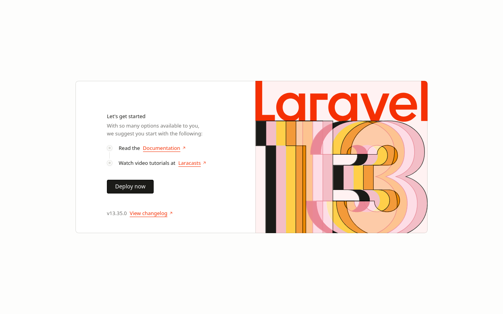

# TugasWeb-P9-LaravelSetup

Tugas Rutin 9 — Setup Laravel (Laravel 13, PHP 8.4, MySQL).



## Langkah Install

1. **Install Composer** dari https://getcomposer.org, lalu cek:
   ```bash
   composer -V
   ```
2. **Buat project Laravel:**
   ```bash
   composer create-project laravel/laravel TugasWeb-P9-LaravelSetup
   cd TugasWeb-P9-LaravelSetup
   ```
   (Kalau clone dari repo ini: jalankan `composer install`, lalu `cp .env.example .env` dan `php artisan key:generate`.)
3. **Buat database** `tugasweb_p9` di phpMyAdmin.
4. **Konfigurasi `.env`:**
   ```env
   DB_CONNECTION=mysql
   DB_HOST=127.0.0.1
   DB_PORT=3306
   DB_DATABASE=tugasweb_p9
   DB_USERNAME=root
   DB_PASSWORD=
   ```
5. **Jalankan migration:**
   ```bash
   php artisan migrate
   ```
6. **Jalankan server:**
   ```bash
   php artisan serve
   ```
   Buka http://localhost:8000

## Controller & Model

Dibuat dengan artisan:

```bash
php artisan make:controller PageController
php artisan make:model Contact -m
```

## Daftar Route

| Method | URL | Keterangan |
|--------|-----|------------|
| GET | `/` | `PageController@home` → view `home` (nama, kampus, daftar skill) |
| GET | `/about` | `PageController@about` → view `about` (deskripsi + tabel tugas) |
| GET | `/contact` | `PageController@contact` → view `contact` (daftar kontak) |
| GET | `/hello/{nama}` | Bonus: route parameter → view `hello` |

Data yang tampil di setiap view dikirim dalam bentuk array dari route/controller, lalu ditampilkan di Blade dengan `{{ }}` dan `@foreach`.

## Struktur Folder

```
TugasWeb-P9-LaravelSetup/
├── app/
│   ├── Http/Controllers/   → controller (PageController.php)
│   └── Models/             → model Eloquent (User.php, Contact.php)
├── bootstrap/              → file bootstrap aplikasi & cache framework
├── config/                 → file konfigurasi (database, app, session, dll.)
├── database/
│   ├── migrations/         → struktur tabel (termasuk create_contacts_table)
│   ├── factories/          → pembuat data dummy
│   └── seeders/            → pengisi data awal
├── docs/                   → screenshot untuk README
├── public/                 → file yang bisa diakses publik (index.php, gambar, css)
├── resources/
│   └── views/              → template Blade
│       ├── layouts/app.blade.php  → layout utama (navbar + footer)
│       ├── home.blade.php
│       ├── about.blade.php
│       ├── contact.blade.php
│       └── hello.blade.php
├── routes/
│   └── web.php             → daftar route web
├── storage/                → log, cache, file upload
├── tests/                  → unit & feature test
├── vendor/                 → library dari Composer (tidak di-upload ke Git)
├── .env                    → konfigurasi environment (tidak di-upload ke Git)
├── artisan                 → command line Laravel
└── composer.json           → daftar dependency PHP
```
